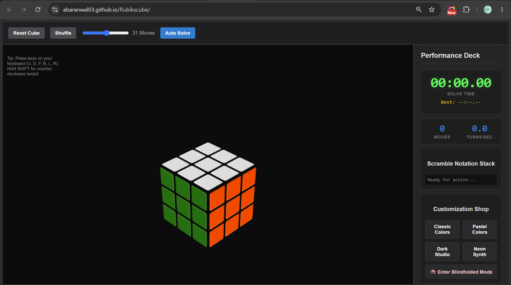

<div align="center">

# 🧊 Rubik's Cube Simulator — Pro Dashboard

**A high-performance, fully interactive 3D Rubik's Cube built entirely from scratch — no engines, no frameworks, just Vanilla Web Technologies pushed to their limit.**

[](#)
[](#)
[](#)
[](#-license)
[](#)

[**🚀 Live Demo**](https://abaranwal03.github.io/rubikscube/) · [Features](#-key-features) · [Controls](#-controls--interactions) · [Roadmap](#-future-roadmap) · [Contributing](#-contributing)



</div>

---

## 📖 Overview

This project renders a fully solvable, speedcubing-grade Rubik's Cube using pure **CSS 3D transforms** and **vanilla JavaScript** — no Three.js, no WebGL, no external libraries. It's built around a custom matrix engine that handles slice rotations, face compensation math, and depth-sorting so the cube behaves exactly like the real thing, right down to the timing tools speedcubers actually use.

---

## ✨ Key Features

| | |
|---|---|
| 🎛️ **Advanced 3D Matrix Engine** | Flawless middle-layer slice execution and outer-face compensation math — no spatial rendering drift, no depth-sorting bugs. |
| ⏱️ **Speedrunning Analytics Deck** | Live stopwatch timer, Turns-Per-Second (TPS) monitor, and an active move counter. |
| 🏆 **Persistent Personal Bests** | Uses `localStorage` to save and track your fastest solve times across browser sessions. |
| 🔀 **WCA Scramble Generator** | Generates and auto-plays official 20-move World Cube Association scramble sequences. |
| ⌨️ **Pro Keyboard Bindings** | Solve at full speed with zero mouse input, using official speedcubing notation (`U`, `D`, `F`, `B`, `L`, `R`). |
| 🎨 **Algorithmic Art & Gamification** | Instantly generate mathematical permutations (Checkerboard, Cube-in-a-Cube) or test yourself in pitch-black **Blindfolded Mode**. |
| 🌗 **Dynamic Theme Shop** | Switch between Classic, Pastel, Dark Studio, and Neon Synth themes via dynamic CSS injection. |

---

## 📁 Repository Structure

```text
├── index.html      # Core DOM structure, 3D viewport, and dashboard UI
├── styles.css      # 3D CSS transform geometry, visual themes, and grid layouts
├── shuffle.js      # Matrix engine, WCA scrambles, and 3D coordinate tracker
├── deck.js         # Dashboard controller: PB caching, macros, stopwatch, keybindings
└── README.md       # Project documentation
🚀 Live Demo▶ Play the Simulator Here!🛠️ Installation & SetupThis project is pure HTML, CSS, and JavaScript — zero dependencies, zero build steps, zero node_modules.Bash# 1. Clone the repository
git clone [https://github.com/abaranwal03/Rubikscube.git](https://github.com/abaranwal03/Rubikscube.git)

# 2. Navigate to the project directory
cd Rubikscube

# 3. Run it
# Just open index.html in any modern browser (Chrome, Firefox, Safari, Edge)
🎮 Controls & Interactions🖱️ Mouse ControlsActionInputRotate CameraClick and drag anywhere in the empty background spaceRotate Face (Clockwise)Click any outer edge pieceRotate Face (Counter-Clockwise)Shift + Click any outer edge pieceRotate Middle SliceClick and drag any center piece in the desired direction⌨️ Keyboard Bindings (Standard Notation)KeyMoveURotate Top FaceDRotate Bottom FaceFRotate Front FaceBRotate Back FaceLRotate Left FaceRRotate Right Face💡 Tip: Hold Shift while pressing any key to execute the prime (counter-clockwise) version of that move.🔮 Future Roadmap[ ] Migrate the 3D CSS rendering engine to Three.js (WebGL) for dynamic lighting, shadows, and realistic plastic textures[ ] Implement an official WCA 15-second pre-solve inspection timer[ ] Add interactive data visualization charts (Ao5, Ao12) to track solve consistency over time🤝 ContributingContributions, issues, and feature requests are highly welcome! Feel free to check the issues page if you'd like to contribute.📝 LicenseThis project is open-source and available under the MIT License.Made with 🧊 and vanilla JavaScript
